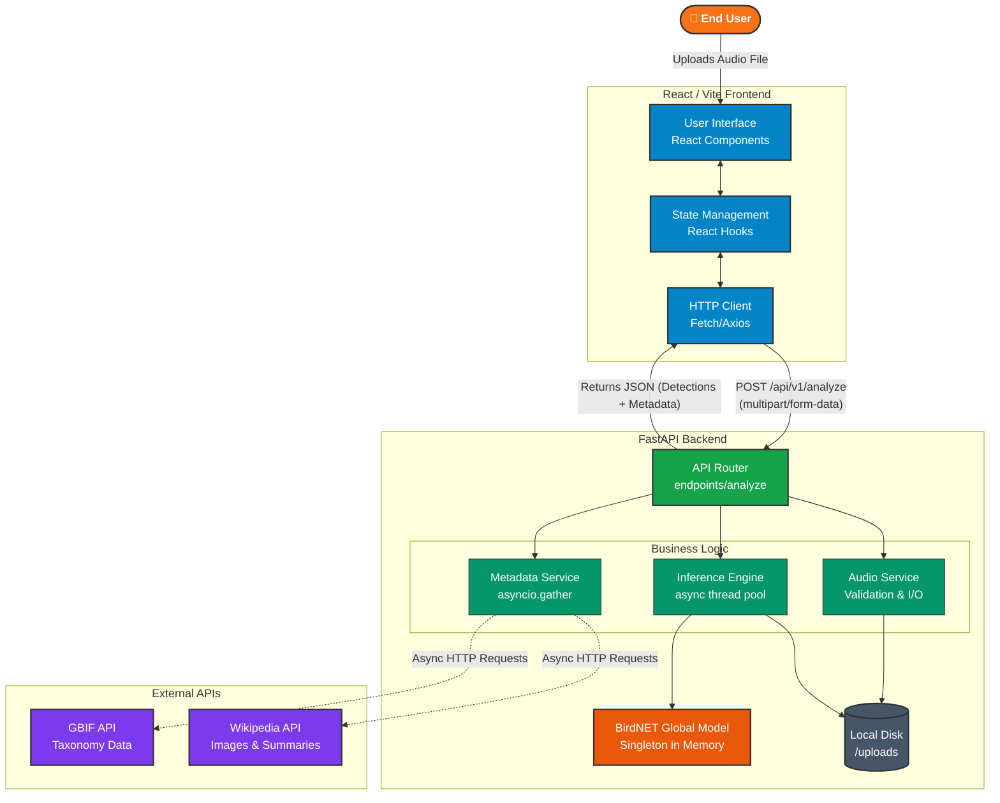

# 🐦 Bird Sound Analyzer

Bird Sound Analyzer is a full-stack web application designed to automatically identify bird species from audio recordings. It leverages the powerful **BirdNET** machine learning model to analyze audio and provide detailed information about the detected birds, including images, taxonomy, and conservation status.

## 🚀 Features

- **Audio Analysis**: Upload audio files (`.wav`, `.mp3`, `.flac`, etc.) to detect bird calls using BirdNET.
- **Detailed Bird Information**: Automatically fetches rich information for each detected species (e.g., descriptions, images, taxonomic order, and IUCN conservation status).
- **Interactive Web Interface**: A sleek, modern React frontend for uploading audio and viewing results.
- **FastAPI Backend**: A high-performance, asynchronous Python backend.
- **Dockerized**: Easy to deploy and run using Docker or Podman Compose.

## 🏗️ Detailed Architectural Design

The application employs a decoupled client-server architecture, designed for asynchronous processing and high performance. Below is a detailed view of the system components and their interactions:



### Component Deep-Dive

#### 1. React Frontend
- **UI & State**: Built with modern React (Vite). It handles the drag-and-drop file upload, loading states, and dynamically renders the analyzed bird data.
- **Communication**: Sends `multipart/form-data` containing the audio to the backend.

#### 2. FastAPI Backend
- **API Router**: The entry point for the application. It receives the audio file and routes it to the underlying services.
- **Global Model Instance**: The BirdNET machine learning model is loaded into memory on application startup (`lifespan` event). This prevents the heavy overhead of loading the TensorFlow model on every single request.
- **Audio Service**: Validates file types (e.g., `.wav`, `.mp3`) and temporarily persists them to a local `/uploads` directory for processing.
- **Inference Engine (`BirdNetService`)**: 
  - Offloads the CPU-blocking audio processing and ML inference to a separate thread pool (`asyncio.to_thread`) so the async server isn't blocked.
  - Filters detections based on minimum confidence thresholds.
- **Metadata Service (`BirdInfoService`)**:
  - Takes the unique scientific names identified by the ML model.
  - Fires **concurrent, asynchronous HTTP requests** (`asyncio.gather`) to Wikipedia and GBIF to fetch rich taxonomy, descriptions, and images, drastically reducing total response time.

#### 3. Storage & Cleanup
- The backend utilizes the local file system ephemerally. Uploaded audio files are written to disk just long enough for the BirdNET library to read them, and are deleted immediately in a `finally` block post-analysis to prevent storage bloat.

#### 4. Containerization
- The backend (Python dependencies, ML model weights, FastAPI server) is packaged into a Docker container, managed by Docker Compose or Podman Compose, ensuring a reproducible environment without local dependency conflicts.

## 🛠️ Tech Stack

- **Frontend**: React, Vite, TypeScript, CSS
- **Backend**: Python, FastAPI, Uvicorn, asyncio
- **Machine Learning**: BirdNET (birdnetlib)
- **Containerization**: Docker / Podman Compose

## 💻 Running the Application Locally

### Prerequisites

- [Podman](https://podman.io/) or Docker, and Compose (for running the backend)
- [Node.js](https://nodejs.org/) (version 18+ recommended) and npm (for the frontend)

### 1. Start the Backend

The backend is built with FastAPI and runs on `http://localhost:7860` by default. You can configure it by creating a `.env` file in the root directory.

Open a terminal in the project root and run:

```bash
# Using Podman
podman compose up -d --build

# Or using Docker
docker-compose up -d --build
```
*(You can access the API Swagger UI documentation at `http://localhost:7860/docs`)*

### 2. Start the Frontend

The React frontend runs on `http://localhost:5173` by default.

Open a second terminal and run:

```bash
cd frontend
npm install
npm run dev
```

### Accessing the App

Once both servers are running, open your browser and navigate to `http://localhost:5173`.

## 🛑 Stopping the Application

- **Frontend**: Press `Ctrl + C` in the terminal running the Vite server.
- **Backend**: Run `podman compose down` or `docker-compose down` in the root directory.
